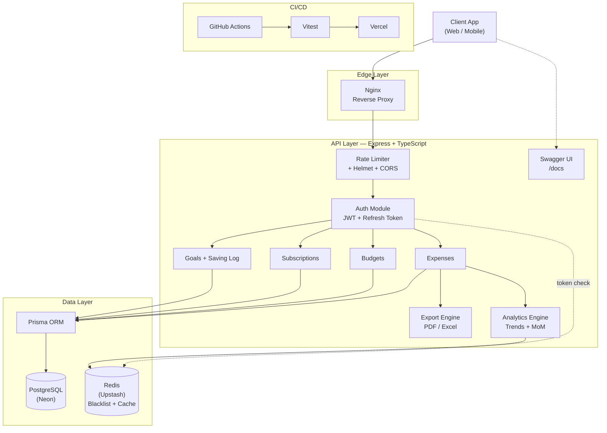

# SISA-BRAPA API

**A backend that actually gets your money.**

Track spending, set budgets, manage subscriptions, and hit your savings goals all through one clean, secure REST API.

---

## What is this?

Most "expense tracker" tutorials stop at basic CRUD. This one doesn't.

SISA-BRAPA API is a production-shaped backend the kind of thing you'd actually feel comfortable putting behind a real app. It handles the boring-but-critical stuff (auth, rate limiting, token blacklisting) and the actually-useful stuff (budgets that warn you before you overspend, subscriptions that track their own due dates, savings goals with a real audit trail) in one coherent system.

No shortcuts, no `any` types, no "TODO: add validation later."

---

## Architecture

Every request funnels through rate limiting and auth before it touches business logic. Redis sits alongside Postgres as a fast lane — killing blacklisted tokens instantly and caching the analytics queries that would otherwise hammer the database every time someone opens their dashboard.

---

## Core Features

### Auth & Security

Short-lived access tokens paired with refresh tokens, so sessions stay alive without leaving long-lived tokens lying around. Logged-out tokens get pushed into a Redis blacklist with an automatic TTL no cron jobs cleaning up after themselves. Login and register endpoints get their own tighter rate limits on top of the global one, and Helmet + CORS keep the HTTP layer locked down.

### Expense Management

Full CRUD on transactions title, amount, category (food, transport, utilities, whatever), date, optional notes. Indexed queries mean filtering by category or date range stays fast even as the table grows.

### Smart Budgeting

Set a monthly cap, either per category or across everything. The system won't let you accidentally create two active budgets for the same category in the same month one source of truth, always.

### Subscriptions & Recurring Bills

Netflix, Spotify, whatever else quietly drains your account every month track it here. Supports weekly, monthly, and yearly billing cycles, and the status (active, pending, cancelled, expired) updates itself based on the current date instead of you having to babysit it.

### Goals & Savings Log

Set a target "Emergency Fund," "New Laptop," whatever you're saving toward — with a deadline and a running balance. Every deposit gets its own entry in the Saving Log, so you can always see exactly how you got to your total, not just the total itself.

### Export Engine

Pull your full expense history as a clean `.xlsx`, or generate a formal `.pdf` report with grand totals and auto-paginated tables when the data won't fit on one page.

### Analytics & Insights

Category breakdowns as percentages, spending trends grouped by day or month across any window (today, 7 days, 30 days, 6 months, or a custom range), and a month-over-month comparison that tells you flat out whether you're saving or bleeding money compared to the same point last month.

---

## Tech Stack

| Layer         | Technology                                                                                                                  | Why                                          |
| ------------- | --------------------------------------------------------------------------------------------------------------------------- | -------------------------------------------- |
| Runtime       |                 | Fast, event-driven, everywhere               |
| Language      |           | Type safety end to end, zero `any`           |
| Framework     |                    | Lightweight, unopinionated, battle-tested    |
| Database      |          | Relational integrity where money is involved |
| ORM           |                       | Type-safe queries, painless migrations       |
| Cache / Store |                          | Token blacklisting + hot analytics caching   |
| Validation    |                                | Keeps garbage data out at the door           |
| Docs          |                  | Interactive, testable API docs               |
| Testing       |                       | Fast, modern unit + integration tests        |
| Containers    |                      | Consistent local + prod environments         |
| CI/CD         |  | Test and ship on every push                  |
| Reverse Proxy |                            | TLS termination + request routing            |
| Deployment    |                         | Serverless-friendly hosting                  |
| DB Hosting    |                         | Serverless Postgres                          |
| Cache Hosting |                        | Serverless Redis                             |

---

## Database Schema

One `User` sits at the center, with everything else hanging off it in a clean one-to-many relationship:

- **User** → credentials, profile, refresh token
- **Expense** → transaction history
- **Budget** → monthly spending caps
- **Subscription** → recurring bills
- **Goal** → savings targets
- **SavingLog** → deposits tied back to a `Goal`

Full schema lives in [`prisma/schema.prisma`](prisma/schema.prisma).

---

## API Endpoints

Interactive docs are served live at `/docs` once the server's running.

| Route                | What it does                                                |
| -------------------- | ----------------------------------------------------------- |
| `/api/auth`          | Register, login, refresh token, logout                      |
| `/api/expenses`      | Create, update, delete, export (PDF/Excel), trend analytics |
| `/api/budgets`       | Set and monitor monthly category budgets                    |
| `/api/subscriptions` | Manage recurring bills and due-date tracking                |
| `/api/goals`         | Savings targets and deposit log                             |

---

