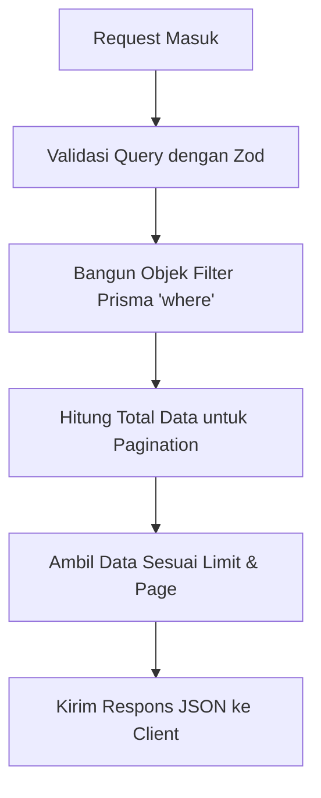
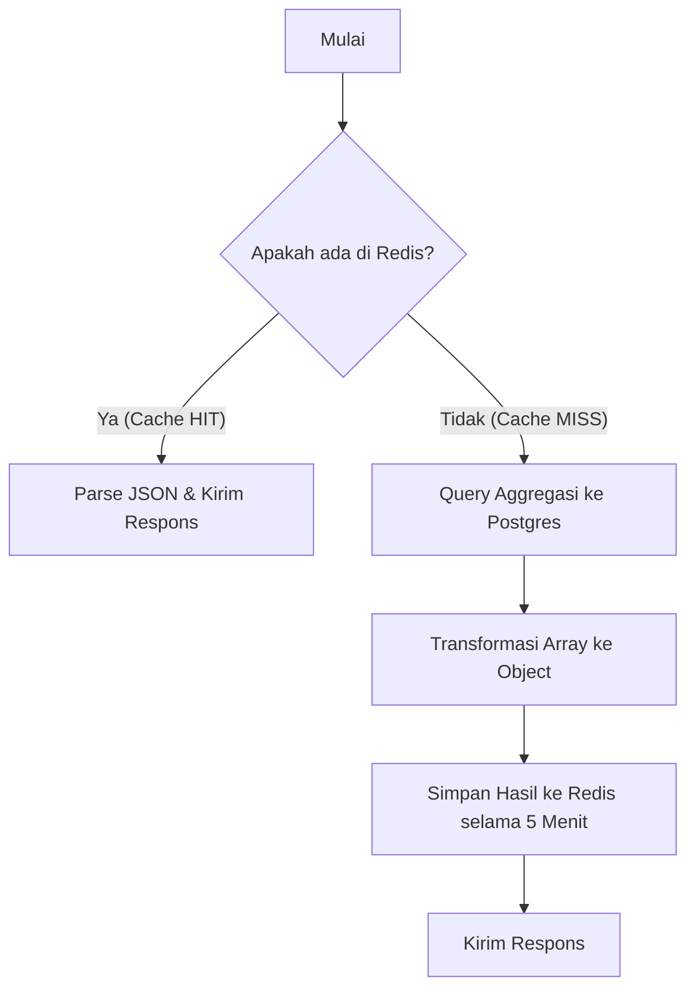

# Panduan Penjelasan Kode: `expense.controller.ts`

Dokumen ini berisi panduan lengkap untuk memahami kode di [expense.controller.ts](file:///C:/Users/zfahr/OneDrive/Desktop/expense-tracker-api/src/controllers/expense.controller.ts). Penjelasan ini dirancang khusus bagi Anda yang sedang mempelajari pengembangan backend menggunakan **Express**, **TypeScript**, dan **Prisma**.

---

## 1. Konsep Dasar & Tipe Data Express + TypeScript

Di bagian atas file, kita mengimpor beberapa tipe dari `express`:

```typescript
import { Request, Response, NextFunction } from "express";
```

Setiap fungsi controller dibungkus dalam bentuk fungsi _asynchronous_ (`async`) dengan deklarasi tipe data TypeScript:

```typescript
export const getAllExpenses = async (
  req: Request,
  res: Response,
  next: NextFunction
): Promise<void> => { ... }
```

### Penjelasan Tipe Data:

- **`req: Request`**: Objek _request_ yang dikirim oleh client. Ini membawa data seperti:
  - `req.query`: Parameter di URL (misal: `/api/expenses?page=1`).
  - `req.body`: Data JSON yang dikirim saat melakukan POST/PUT.
  - `req.params`: Parameter dinamis pada rute (misal: `/api/expenses/:id`).
- **`res: Response`**: Objek _response_ untuk mengembalikan data ke client (seperti `res.json()` atau `res.status()`).
- **`next: NextFunction`**: Fungsi untuk meneruskan eksekusi ke middleware berikutnya. Jika ada error, kita memanggil `next(error)` untuk mengirimkannya ke handler error terpusat.
- **`Promise<void>`**: Menunjukkan bahwa fungsi ini bertipe `async` (mengembalikan Promise) dan tidak me-return value apa pun lewat kata kunci `return` (hanya mengirim response HTTP via objek `res`).

---

## 2. Mengenal Operator Non-null Assertion (`req.user!.id`)

Di hampir semua fungsi, Anda akan melihat kode berikut:

```typescript
const userId = req.user!.id;
```

> [!NOTE]
> Properti `req.user` disisipkan ke dalam request secara dinamis oleh middleware autentikasi (seperti JWT auth) setelah memverifikasi token login.

- **Mengapa memakai tanda seru (`!`)?**
  Secara bawaan, TypeScript menganggap `req.user` bisa bernilai `undefined`. Dengan menambahkan tanda seru (`!`), kita menegaskan kepada compiler TypeScript:
  _"Saya menjamin bahwa `req.user` pasti ada (tidak null/undefined) pada tahap ini karena rute ini dilindungi middleware auth. Jangan keluarkan error saat kompilasi."_

---

## 3. Bedah Fungsi `getAllExpenses` (Filter, Search, & Pagination)

Fungsi ini bertugas mengambil daftar pengeluaran berdasarkan filter yang diinginkan pengguna.



### Langkah 1: Validasi Parameter Query (Zod)

```typescript
const query = expenseQuerySchema.parse(req.query);
const { page, limit, category, month, year, search, sortBy, sortOrder } = query;
```

- Kita tidak langsung memakai data mentah dari `req.query`. Kita memfilternya dengan skema Zod `expenseQuerySchema` untuk memastikan keamanan tipe data (contohnya memastikan `page` adalah angka, bukan string).

### Langkah 2: Menyusun Kondisi Pencarian (`where`)

```typescript
const where: Prisma.ExpenseWhereInput = { userId };

if (category) {
  where.category = category;
}
```

- **`Prisma.ExpenseWhereInput`**: Tipe data otomatis dari Prisma untuk mendefinisikan kriteria pencarian database.
- Di sini kita membatasi agar data yang dicari hanya milik `userId` yang aktif. Jika ada filter kategori, kita menambahkannya ke kriteria.

### Langkah 3: Filter Rentang Bulan & Tahun

```typescript
if (month || year) {
  const targetYear = year || new Date().getFullYear();
  const targetMonth = month || new Date().getMonth() + 1;
  where.date = {
    gte: new Date(targetYear, targetMonth - 1, 1),
    lt: new Date(targetYear, targetMonth, 1),
  };
}
```

- Karena kolom `date` menyimpan format tanggal lengkap, kita memfilternya menggunakan rentang:
  - `gte` (_greater than or equal_): Tanggal 1 di bulan yang dipilih (misal: `2026-07-01`).
  - `lt` (_less than_): Sebelum tanggal 1 di bulan berikutnya (misal: `2026-08-01`).

### Langkah 4: Pencarian Kata Kunci (Search)

```typescript
if (search) {
  where.title = {
    contains: search,
    mode: "insensitive", // Tidak sensitif huruf kapital
  };
}
```

- Mencari data yang judulnya (`title`) mengandung kata kunci `search` secara case-insensitive (mengabaikan huruf besar/kecil).

### Langkah 5: Kalkulasi Pagination & Pengambilan Data

```typescript
const totalData = await prisma.expense.count({ where });
const totalPages = Math.ceil(totalData / limit);

const expenses = await prisma.expense.findMany({
  where,
  orderBy: { [sortBy]: sortOrder },
  skip: (page - 1) * limit,
  take: limit,
});
```

- `prisma.expense.count`: Menghitung total data di database.
- `Math.ceil`: Membulatkan ke atas untuk menghitung jumlah total halaman.
- `findMany`:
  - `orderBy`: Mengurutkan data (misal berdasarkan tanggal atau nominal).
  - `skip`: Melompati sejumlah data. Jika kita di halaman 2 dengan limit 10, kita melompati `(2-1) * 10 = 10` data pertama.
  - `take`: Mengambil data sebanyak jumlah limit.

---

## 4. Bedah Fungsi `getExpenseById` (Detail Data)

```typescript
const id = req.params.id as string;

const expense = await prisma.expense.findFirst({
  where: { id, userId },
});

if (!expense) {
  res.status(404).json({ status: 404, message: "Expense tidak ditemukan", data: null });
  return;
}
```

- **`req.params.id`**: Membaca parameter ID dari URL (misal: `/api/expenses/123`).
- **Proteksi Keamanan**: Kita menggunakan `findFirst` dengan kondisi `{ id, userId }`. Ini mencegah kebocoran data; jika pengguna mencoba memanggil ID milik orang lain, sistem akan mengembalikan status **404 Not Found**.

---

## 5. Bedah Fungsi `createExpense` (Menambah Data & Invalidate Cache)

```typescript
const expense = await prisma.expense.create({
  data: {
    title,
    amount,
    category,
    date: date ? new Date(date) : undefined,
    note,
    userId,
  },
});
```

- `prisma.expense.create`: Menyisipkan data baru ke dalam database PostgreSQL.

```typescript
// Invalidate Redis cache
try {
  const keys = await redis.keys(`summary:${userId}:*`);
  if (keys.length > 0) {
    await redis.del(...keys);
  }
} catch (redisErr) {
  console.error("Redis cache invalidation error:", redisErr);
}
```

- **Mengapa perlu menghapus cache?** Ketika data pengeluaran baru ditambahkan, data laporan bulanan/analitik yang tersimpan di memori Redis Cache menjadi usang (tidak akurat).
- Kode di atas mencari semua kunci cache ringkasan milik pengguna tersebut (`summary:userId:*`) dan menghapusnya agar sistem dipaksa menghitung ulang pada request berikutnya.

---

## 6. Bedah Fungsi `updateExpense` & `deleteExpense` (Proteksi Kepemilikan)

Sebelum melakukan update atau delete, server selalu memeriksa apakah data tersebut ada dan dimiliki oleh pengguna yang sedang masuk:

```typescript
const existing = await prisma.expense.findFirst({
  where: { id, userId },
});

if (!existing) {
  res.status(404).json({ status: 404, message: "Expense tidak ditemukan", data: null });
  return;
}
```

> [!IMPORTANT]
> Tanpa pemeriksaan kepemilikan (`userId`), pengguna yang nakal dapat memodifikasi atau menghapus data milik orang lain hanya dengan menebak/mengubah ID pada request.

---

## 7. Bedah Fungsi `getExpenseSummary` (Redis Caching & Aggregation)

Fungsi ini digunakan untuk menampilkan statistik total pengeluaran berdasarkan kategori. Fungsi ini mengimplementasikan **caching** agar performa lebih cepat.



### Langkah 1: Membuat Kunci Cache Unik

```typescript
const cacheKey = `summary:${userId}:${targetYear}:${targetMonth}`;
```

- Membuat nama kunci di Redis yang unik untuk setiap pengguna, tahun, dan bulan. Contoh: `summary:12:2026:7`.

### Langkah 2: Cek Cache Redis (Cache HIT)

```typescript
const cached = await redis.get(cacheKey);
if (cached) {
  res.json({ ...JSON.parse(cached), fromCache: true });
  return;
}
```

- Jika data sudah ada di Redis, server langsung mengirim data tersebut kembali ke client tanpa melakukan query database. Ini memangkas waktu respons dari ratusan milidetik menjadi di bawah 5 milidetik.

### Langkah 3: Query Aggregasi Database (Cache MISS)

```typescript
const grouped = await prisma.expense.groupBy({
  by: ["category"],
  where,
  _sum: { amount: true },
  _count: { id: true },
});
```

- Jika cache tidak ada, server menggunakan perintah `groupBy` di Prisma (setara dengan `GROUP BY` di SQL). Ini menjumlahkan nominal transaksi (`_sum.amount`) dan menghitung jumlah transaksi (`_count.id`) berdasarkan masing-masing kategori.

### Langkah 4: Transformasi Data (`.reduce`)

```typescript
const summary = grouped.reduce<Record<string, { total: number; count: number }>>((acc, item) => {
  acc[item.category] = {
    total: item._sum.amount || 0,
    count: item._count.id,
  };
  return acc;
}, {});
```

- Hasil grouping dari database biasanya berbentuk array:
  `[{ category: 'Food', _sum: { amount: 50000 }, _count: { id: 2 } }]`
- Fungsi `.reduce()` di atas mengubahnya menjadi format object yang bersih agar mudah dikonsumsi frontend:
  `{ "Food": { "total": 50000, "count": 2 } }`

### Langkah 5: Simpan ke Redis Cache

```typescript
await redis.setex(cacheKey, 300, JSON.stringify(result));
```

- Menyimpan hasil kalkulasi ke Redis dengan durasi kedaluwarsa **300 detik (5 menit)** agar request berikutnya tidak perlu melakukan hitung ulang ke database PostgreSQL.
